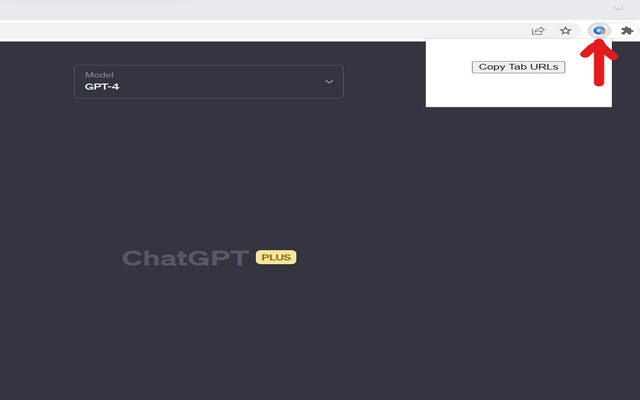

# TabSnap - Chrome Extension

TabSnap is a browser extension that allows you to quickly copy the URLs of all open tabs to your clipboard.

## Features

- One-click copying of tab URLs to clipboard
- Exclude Chrome extension page URL (chrome://extensions/)
- Cross-platform compatibility
- Lightweight and easy to use

## Installation

To install the TabSnap extension, follow these steps:

1. Clone or download the repository.
2. Open Google Chrome and go to the Extensions page (chrome://extensions/).
3. Enable "Developer mode" using the toggle switch in the top right corner.
4. Click on "Load unpacked" and select the cloned/downloaded TabSnap directory.
5. The TabSnap extension will be added to your browser.

## Usage

Once the TabSnap extension is installed, you can use it by following these steps:

1. Click on the TabSnap icon in the browser toolbar.
2. The URLs of all open tabs, excluding the Chrome extension page, will be copied to your clipboard.

## Contributions

Contributions are welcome! If you find any issues or have suggestions for improvement, please feel free to create a pull request or submit an issue on the GitHub repository.

## License

This project is licensed under the [MIT License](LICENSE).
